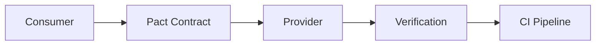

# Shopstream Testing Strategy

## Overview
Comprehensive testing approach ensuring quality, reliability, and maintainability across all services.

## Testing Levels

### 1. Unit Tests
**Target Coverage**: 80% minimum
**Tools**: Jest (Node.js), React Testing Library (Frontend)
**Scope**: Individual functions, components, utilities

```typescript
// Example: catalog-service unit test
describe('ProductService', () => {
  it('should calculate discount price correctly', () => {
    const result = calculateDiscount(100, 0.2);
    expect(result).toBe(80);
  });
});
```

### 2. Integration Tests  
**Target Coverage**: Critical paths
**Tools**: Supertest, TestContainers, Prisma test utilities
**Scope**: API endpoints, database operations, service interactions

```typescript
// Example: API integration test
describe('POST /api/products', () => {
  it('should create product and emit event', async () => {
    const response = await request(app)
      .post('/api/products')
      .send(productData)
      .expect(201);
    
    expect(eventBridge.publish).toHaveBeenCalled();
  });
});
```

### 3. Contract Tests
**Tools**: Pact (REST), Buf (gRPC)
**Scope**: API contracts between services

- Consumer-driven contracts for REST APIs
- Protocol buffer compatibility checks for gRPC
- Schema validation for events

### 4. End-to-End Tests
**Tools**: Playwright (primary), Cypress (alternative)
**Scope**: Critical user journeys

Key Scenarios:
- User registration and login
- Product search and browse
- Add to cart and checkout
- Order tracking
- Admin product management

### 5. Performance Tests
**Tools**: k6 (API), Lighthouse (Frontend)
**Targets**:
- API response time p95 < 200ms
- Frontend LCP < 2s
- Checkout flow < 5s end-to-end

### 6. Security Tests
**Tools**: 
- GitHub CodeQL (SAST)
- ECR image scanning
- OWASP ZAP (DAST)
- npm audit / yarn audit

## Test Environments

### Local Development
- LocalStack for AWS services
- TestContainers for databases
- Mock servers for external APIs (Stripe, etc.)

### CI Environment
- GitHub Actions runners
- Ephemeral test databases
- Parallel test execution

### Staging Environment
- Dedicated AWS account
- Production-like configuration
- Synthetic monitoring

## Testing in CI/CD Pipeline

```yaml
# GitHub Actions example
test:
  runs-on: ubuntu-latest
  steps:
    - name: Unit Tests
      run: npm test -- --coverage
    
    - name: Integration Tests
      run: npm run test:integration
    
    - name: Contract Tests
      run: npm run test:contract
    
    - name: Security Scan
      uses: github/codeql-action/analyze@v2
    
    - name: Performance Budget
      run: npm run lighthouse:ci
```

## Service-Specific Testing

### identity-service
- Password hashing verification
- JWT token generation/validation
- Rate limiting behavior
- Session management

### catalog-service  
- Prisma migrations testing
- Optimistic locking scenarios
- Event publishing verification
- Multi-tenancy isolation

### orders-service
- Step Functions workflow testing
- Idempotency verification
- Compensation flow testing
- Payment integration mocking

### realtime-service
- WebSocket connection handling
- Message delivery guarantees
- Reconnection logic
- Fallback to SSE

## Testing Best Practices

1. **Test Data Management**
   - Use factories for test data generation
   - Seed scripts for consistent state
   - Cleanup after test runs

2. **Mocking Strategy**
   - Mock external services (Stripe, SES)
   - Use LocalStack for AWS services
   - Real databases for integration tests

3. **Test Organization**
   ```
   service/
   ├── src/
   ├── tests/
   │   ├── unit/
   │   ├── integration/
   │   ├── fixtures/
   │   └── helpers/
   ```

4. **Continuous Testing**
   - Pre-commit hooks for unit tests
   - PR checks for full test suite
   - Nightly E2E test runs
   - Weekly chaos tests

## Monitoring Test Health

### Metrics to Track
- Test execution time
- Flaky test frequency
- Coverage trends
- Test failure patterns

### Test Reports
- Coverage reports in PRs
- Test result trends in dashboard
- Performance regression alerts
- Security vulnerability reports

## Chaos Testing

Using AWS Fault Injection Simulator:
- Network latency injection
- Service unavailability
- Database connection failures
- Rate limit simulation

## Load Testing Scenarios

1. **Steady State**: Normal traffic patterns
2. **Flash Sale**: 10x spike in checkout
3. **Feed Storm**: High WebSocket connections
4. **Search Surge**: Typeahead under load

## Contract Testing Flow



## Testing ROI Priority

1. **High Priority** (Must Have)
   - Unit tests for business logic
   - Integration tests for APIs
   - E2E for checkout flow
   - Security scanning

2. **Medium Priority** (Should Have)
   - Contract tests
   - Performance tests
   - More E2E scenarios

3. **Low Priority** (Nice to Have)
   - Visual regression tests
   - Accessibility automation
   - Mutation testing